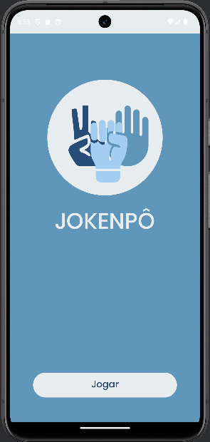
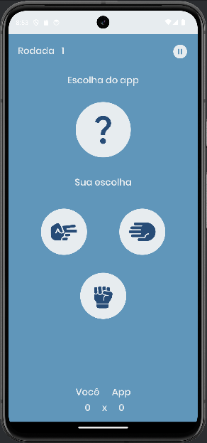
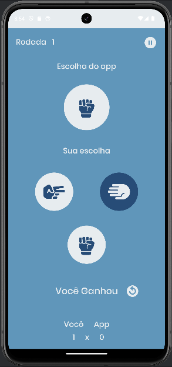

<div align="center">
  
</div>

# Jokenpô

Um aplicativo simples de Pedra, Papel e Tesoura desenvolvido em Java para Android.

## Índice

- [Visão Geral](#visão-geral)
- [Funcionalidades](#funcionalidades)
- [Instalação](#instalação)
- [Como Jogar](#como-jogar)
- [Capturas de Tela](#capturas-de-tela)

## Visão Geral

Este é um aplicativo Android simples que permite ao usuário jogar Pedra, Papel e Tesoura contra o computador. O objetivo principal deste projeto é servir como um exercício prático para desenvolvedores iniciantes em Java e desenvolvimento Android.

## Funcionalidades

- Escolha entre Pedra, Papel e Tesoura.
- O aplicativo determina o vencedor com base nas escolhas do jogador e do computador.
- Interface de usuário simples e intuitiva.
- Opção para jogar nova rodada.
- Opção para começar novo jogo.
- Exibição de pontuação acumulada.
- Exibição da rodada jogada.

## Instalação

### Pré-requisitos

- Android Studio instalado em sua máquina.
- Um dispositivo Android ou um emulador configurado.

### Passos para instalação

1. Clone este repositório para sua máquina local usando o comando:
    ```bash
    git clone https://github.com/isabellatressino/rock-paper-scissors-java.git
    ```
2. Abra o Android Studio e importe o projeto clonado.
3. Conecte seu dispositivo Android ou inicie um emulador.
4. Clique no botão "Run" para compilar e instalar o aplicativo.

## Como Jogar

1. Abra o aplicativo em seu dispositivo Android.
2. Na tela principal, selecione o botão jogar.
3. Na tela do jogo,  selecione Pedra, Papel ou Tesoura tocando no respectivo ícone.
4. O aplicativo irá automaticamente fazer a escolha do computador e determinar o vencedor.
5. Veja o resultado exibido na tela.
6. Clique no icone de recomeçar para jogar uma nova rodada.
7. Use o botão de pausar para pausar o jogo.
8. Use o botão de iniciar novo jogo para resetar o jogo e começar novamente.
9. Acompanhe sua pontuação enquanto joga.

## Capturas de Tela

| Tela Principal                              | Tela do Jogo                                | Tela do Jogo Atividade                             |
|---------------------------------------------|---------------------------------------------|----------------------------------------------------|
|  |  |  |